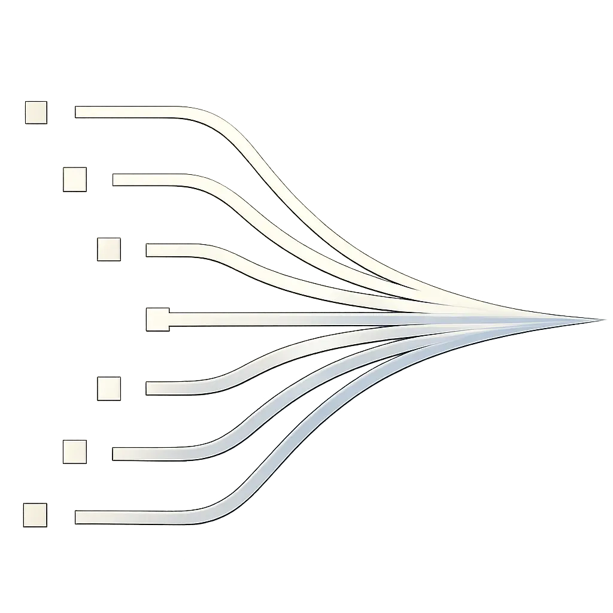

# OpenWA Dashboard

<p align="center">
  
</p>

Modern web dashboard for managing OpenWA WhatsApp API Gateway sessions, webhooks, and infrastructure.

## ✨ Features

- **Session Management** - Create, monitor, and control WhatsApp sessions
- **QR Code Authentication** - Real-time QR code display for device pairing
- **Webhook Configuration** - Configure and test webhook endpoints
- **API Key Management** - Generate and manage API keys
- **Infrastructure Monitoring** - View system health and storage status
- **Real-time Updates** - Live session status via WebSocket

## 🛠️ Tech Stack

| Technology       | Purpose                 |
| ---------------- | ----------------------- |
| React 19         | UI Framework            |
| TypeScript       | Type Safety             |
| Vite 7           | Build Tool              |
| React Router 7   | Client-side Routing     |
| TanStack Query   | Server State Management |
| TanStack Table   | Data Tables             |
| Socket.IO Client | Real-time Communication |
| Lucide React     | Icons                   |

## 🚀 Getting Started

### Prerequisites

- Node.js 20+
- npm or yarn

### Development

```bash
# Install dependencies
npm install

# Start development server
npm run dev
```

Dashboard will be available at `http://localhost:2886`

### Production Build

```bash
# Build for production
npm run build

# Preview production build
npm run preview
```

## 📁 Project Structure

```
dashboard/
├── src/
│   ├── components/     # Reusable UI components
│   ├── pages/          # Page components
│   ├── hooks/          # Custom React hooks
│   ├── services/       # API service layer
│   ├── types/          # TypeScript definitions
│   ├── utils/          # Utility functions
│   ├── App.tsx         # Root component
│   ├── App.css         # Global styles
│   └── main.tsx        # Entry point
├── public/             # Static assets
├── index.html          # HTML template
└── vite.config.ts      # Vite configuration
```

## 🔗 API Connection

The dashboard connects to the OpenWA API backend. Configure the API URL in environment variables:

```bash
VITE_API_URL=http://localhost:2785
```

## 📄 License

MIT License - Part of the [OpenWA](https://github.com/rmyndharis/OpenWA) project.
